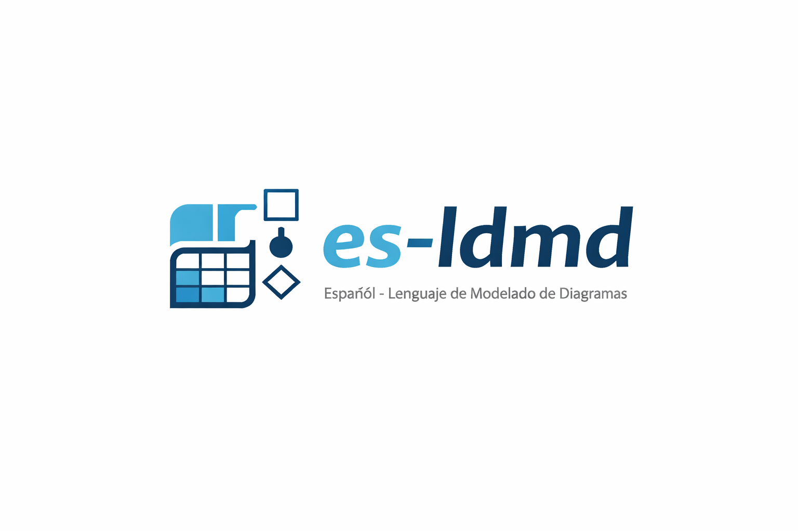

<p align="center">
  
</p>

<h3 align="center">Español - Lenguaje de Modelado de Diagramas</h3>

<p align="center">
  Editor web para diseñar diagramas Entidad-Relación usando un lenguaje de modelado en español.
</p>

<p align="center">
  <a href="https://es-ldmd.com/">Probar en línea</a> &middot;
  <a href="https://es-ldmd.com/documentacion">Documentación</a>
</p>

---

## Qué es es-ldmd

**es-ldmd** es una herramienta que permite definir esquemas de bases de datos mediante un DSL (Domain Specific Language) escrito completamente en español. El código se analiza en tiempo real, genera un diagrama Entidad-Relación visual y permite exportar a SQL o imagen.

### Características principales

- Lenguaje de modelado en español con autocompletado
- Visualización de diagramas en tiempo real
- Exportación a SQL e imagen
- Validación sintáctica y semántica con mensajes en español
- Asistente de IA local integrado (WebLLM)
- Persistencia en localStorage

## Ejemplos del lenguaje

### Definir una tabla

```
Tabla usuarios {
    id entero [incremento]
    nombre texto(100) [no nulo]
    correo texto(255) [no nulo, nota: 'Correo único del usuario']
    activo lógico [por_defecto: `true`]

    primaria {
        id
    }
}
```

### Llaves foráneas y cascada

```
Tabla productos {
    id entero [incremento]
    nombre texto(200) [no nulo]
    precio decimal [no nulo]
    categoria_id entero [no nulo]

    primaria {
        id
    }

    foranea {
        categoria_id categorias(id) [eliminación en cascada]
    }
}
```

### Llave primaria compuesta

```
Tabla detalle_pedidos {
    pedido_id entero [no nulo]
    producto_id entero [no nulo]
    cantidad entero [no nulo, por_defecto: `1`]

    primaria {
        pedido_id
        producto_id
    }

    foranea {
        pedido_id pedidos(id) [eliminación en cascada, actualización en cascada]
        producto_id productos(id)
    }
}
```

### Agrupar tablas

```
Grupo ventas {
    pedidos
    detalle_pedidos
}
```

## Stack tecnológico

| Categoría | Tecnología |
|-----------|------------|
| Framework | Next.js 16 |
| UI | Mantine 8 |
| Editor | Monaco Editor |
| Lenguaje | TypeScript |
| Testing | Vitest |
| Despliegue | Docker + Dokploy |

## Desarrollo local

```bash
# Instalar dependencias
pnpm install

# Iniciar servidor de desarrollo
pnpm dev

# Ejecutar tests
pnpm test

# Build de producción
pnpm build
```

## Licencia

Proyecto privado. Todos los derechos reservados.
